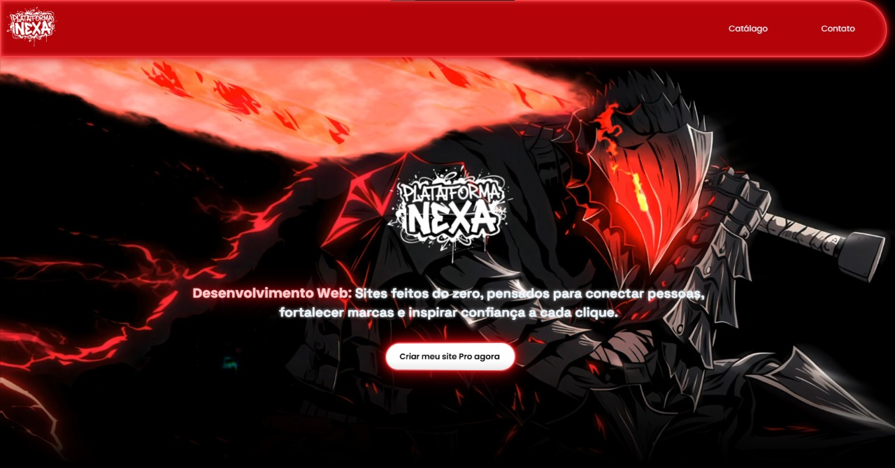

# Plataforma Nexa — Soluções Digitais para Impulsionar Microempresas 🚀🌐

Bem-vindo ao repositório oficial da **Plataforma Nexa**!  
Este projeto representa meu trabalho como desenvolvedor, focado em **criação de sites profissionais**, **animação de imagens (imagens vivas)** e **artes criativas para marketing digital**.

A proposta não é vender diretamente, mas sim **apresentar portfólio, serviços e conteúdo**, com um design moderno, impactante e totalmente responsivo.

---

## 🔗 Acesse o projeto online
👉 **Site ao vivo funcionando:** https://plataforma-nexa.netlify.app

---

## 📸 Preview do Site


---

## 💡 Serviços oferecidos na Nexa

✅ **Criação de Sites Profissionais** para pequenas e microempresas  
✅ **Imagens Vivas — animação de imagens estáticas** para gerar mais impacto visual  
✅ **Artes de Marketing Digital** para redes sociais, campanhas e identidade visual  
✅ Layout interativo, moderno e **totalmente responsivo (desktop + mobile)**  
✅ Animações suaves nas seções, transições e efeitos dinâmicos  
✅ Interface limpa e sem distrações visuais externas  

---

## 🛠️ Tecnologias utilizadas

- **HTML5**
- **CSS3** (Flexbox, Grid, animações e responsividade)
- **JavaScript** (Efeitos, interações e animações na tela)
- **Vídeos incorporados via YouTube embed** como fundo sem UI
- **Hospedagem via Netlify**

---

## 👨‍💻 Criador

**Gabriel Cristino**  
📍 Fortaleza, Ceará — Brasil  
📧 Email: gabriel.oficial.cristino@gmail.com  
🔗 LinkedIn: https://www.linkedin.com/in/gabrielcristino1  
🐙 GitHub: https://github.com/gban01  
📷 Instagram: https://www.instagram.com/eugbazinoficial  

---

## 🚀 Como rodar o projeto localmente

```bash
git clone https://github.com/gban01/Plataforma-Nexa.git
cd "Sites preview"
open home.html
